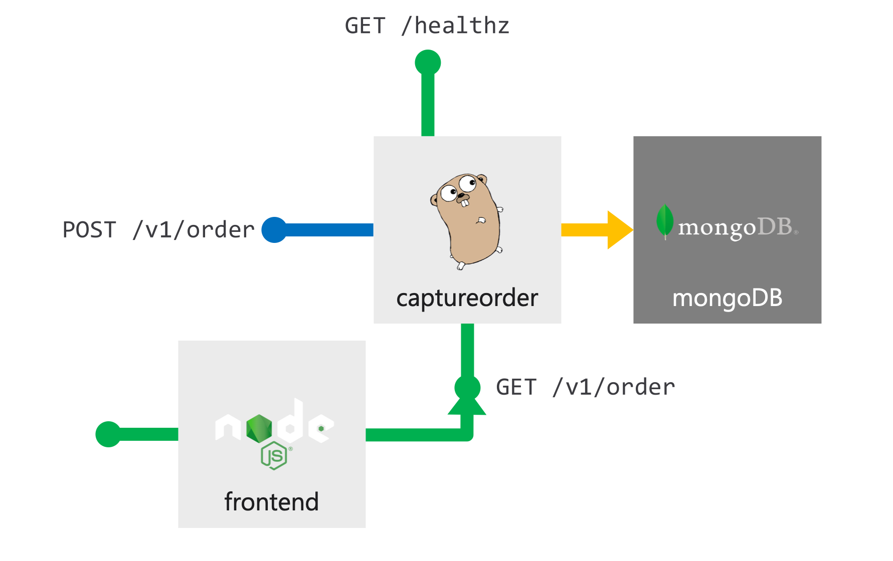

# Managing Azure Kubernetes Service: What you need to know about day two operations.

This is the repository for Ignite Session - Managing Azure Kubernetes Service: What you need to know about day two operations.

In this workshop you'll walk through the following task:

- Deploy application to AKS
- Use Container Insights to trouvleshoot application issues
- Scale application to meet request demand
- View and fix security recommendations from Azure Security Center
- Apply Policy to govern your AKS resources


## Connect to AKS cluster

1. Login to Azure Portal at <http://portal.azure.com.>
2. Open the Azure Cloud Shell and choose Bash Shell (do not choose Powershell)

   

3. The first time Cloud Shell is started will require you to create a storage account.

4. Once your cloud shell is started, clone the workshop repo into the cloud shell environment

   ```bash
   git clone https://github.com/Azure/ignite-day2-aks
   ```

5. Now you'll need to get your credentials for your Kubernetes cluster. Run the below command to pull down the credentials:

```bash
az aks get-credentials -n <Cluster_Name_> -g <resource_group>
```

## Deploy Application

You'll be deploying the following application to your AKS Cluster

   

The application consists of 3 components:

- A public facing Order Capture swagger enabled API
- A public facing frontend
- A MongoDB database

You'll first need to setup Helm, as we'll use it to deploy the MongoDB database.

Apply the following manifest to setup RBAC for helm:

```bash
kubectl apply -f ./manifest/helm-rbac.yaml
```

Now we will initialize Helm and it will be deployed to the cluster

```bash
helm init --service-account tiller
```

Now that we have Helm setup we'll now deploy are MongoDB database

```bash
helm install stable/mongodb --name orders-mongo --set mongodbUsername=orders-user,mongodbPassword=orders-password,mongodbDatabase=akschallenge
```
***This will take a couple minutes to fully deploy***

We'll now create the secrets the application will use to connect to the MongoDB Database

```bash
kubectl create secret generic mongodb --from-literal=mongoHost="orders-mongo-mongodb.default.svc.cluster.local" --from-literal=mongoUser="orders-user" --from-literal=mongoPassword="wrong-password"
```


To deploy the application we will need to deploy a set of pre-created set of Kubernetes manifest files. Perform the following command in the cloud shell to deploy the manifest:

```bash
kubectl apply -f ./manifest/app .
```

Now that your app is deployed you can check the status of it with the following command:

```bash
kubectl get pods
```
You should see the following output:

```bash
//TODO: add screenshot
```

You'll notice that the app is in a CrashLoopBack, so in the next section we will troubleshoot the issue with Azure Container Insights

## Troubleshoot Application with Azure Container Insights


## View and remediate recommendations from Azure Security Center


## Apply a policy with Azure Policy For AKS to govern resources


## Legal Notices

Microsoft and any contributors grant you a license to the Microsoft documentation and other content
in this repository under the [Creative Commons Attribution 4.0 International Public License](https://creativecommons.org/licenses/by/4.0/legalcode),
see the [LICENSE](LICENSE) file, and grant you a license to any code in the repository under the [MIT License](https://opensource.org/licenses/MIT), see the
[LICENSE-CODE](LICENSE-CODE) file.

Microsoft, Windows, Microsoft Azure and/or other Microsoft products and services referenced in the documentation
may be either trademarks or registered trademarks of Microsoft in the United States and/or other countries.
The licenses for this project do not grant you rights to use any Microsoft names, logos, or trademarks.
Microsoft's general trademark guidelines can be found at http://go.microsoft.com/fwlink/?LinkID=254653.

Privacy information can be found at https://privacy.microsoft.com/en-us/

Microsoft and any contributors reserve all other rights, whether under their respective copyrights, patents,
or trademarks, whether by implication, estoppel or otherwise.
