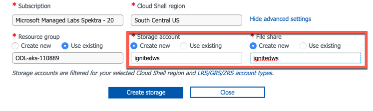

# Managing Azure Kubernetes Service: What you need to know about day two operations.

This is the repository for Ignite Session - Managing Azure Kubernetes Service: What you need to know about day two operations.

In this workshop you'll walk through the following task:

- Deploy application to AKS
- Use Container Insights to troubleshoot application issues
- Scale application to meet request demand
- View and fix security recommendations from Azure Security Center
- Apply Policy to govern your AKS resources


## Connect to AKS cluster

1. Login to Azure Portal at <http://portal.azure.com.>
2. Open the Azure Cloud Shell and choose Bash Shell (do not choose Powershell)

    

3. The first time Cloud Shell is started will require you to create a storage account. __Make sure you click on"Show Advanced Settings"__ Use the existing resource group and create a new storage account and file share.

    

4. Once your cloud shell is started, clone the workshop repo into the cloud shell environment

   ```bash
   git clone https://github.com/Azure/ignite-day2-aks
   ```

5. Now you'll need to get your credentials for your Kubernetes cluster. Run the below command to pull down the credentials:

```bash
az aks get-credentials -n <Cluster_Name_> -g <resource_group>
```

**Tip: You can get your cluster name and resource group with the following command:

```bash
az aks list
```

## Deploy Application

You'll be deploying the following application to your AKS Cluster

   

The application consists of 3 components:

- A public facing Order Capture swagger enabled API
- A public facing frontend
- A MongoDB database

You'll first need to setup Helm, as we'll use it to deploy the MongoDB database.

Apply the following manifest to setup RBAC for helm:

```bash
kubectl apply -f ignite-day2-aks/manifest/helm-rbac.yaml
```

Now we will initialize Helm and it will be deployed to the cluster

```bash
helm init --service-account tiller
```

**wait approximately 20 seconds before running the next command**

Now that we have Helm setup we'll now deploy are MongoDB database

```bash
helm install stable/mongodb --name orders-mongo --set mongodbUsername=orders-user,mongodbPassword=orders-password,mongodbDatabase=akschallenge
```
***This will take a couple minutes to fully deploy***

We'll now create the secrets the application will use to connect to the MongoDB Database

```bash
kubectl create secret generic mongodb --from-literal=mongoHost="orders-mongo-mongodb.default.svc.cluster.local" --from-literal=mongoUser="orders-user" --from-literal=mongoPassword="wrong-password"
```


To deploy the application we will need to deploy a set of pre-created set of Kubernetes manifest files. Perform the following command in the cloud shell to deploy the manifest:

```bash
kubectl apply -f ignite-day2-aks/manifest/app
```

Now that your app is deployed you can check the status of it with the following command:

```bash
kubectl get pods
```
You should see the following output:

```bash
odl_user@Azure:~$ kubectl get pods
NAME                                   READY   STATUS             RESTARTS   AGE
azure-vote-back-5966fd4fd4-w7tnn       1/1     Running            0          14m
azure-vote-front-67fc95647d-kgls8      1/1     Running            0          14m
captureorder-894bbf6d7-crdbd           0/1     Error              1          62s
captureorder-894bbf6d7-sgvgf           0/1     CrashLoopBackOff   2          62s
frontend-794fbc469-7rk7z               1/1     Running            0          62s
orders-mongo-mongodb-9d7ccf7f5-wm995   1/1     Running            0          2m7s
```

You'll notice that the "captureorder" service is in a CrashLoopBack/error state, so in the next section we will troubleshoot the issue with Azure Container Insights

## Troubleshoot Application with Azure Container Insights

In the Azure portal navigate to your AKS cluster, which is listed under "Kubernetes Service. Once you have selected your cluster, select "Monitor Containers" in the center screen navigation.


Now select "Controllers" from the top navigation and scroll to you find the "captureorder" controller. Now select "live logs" on the right panel to see the logs for the captureorder service.

You'll see that the "connection is refused" and if we look at the Environmental Variable on the right side we can see we have  "wrong-password" for the MongoDB server. Since we have the wrong password our app is unable to make a connection to the MongoDB database that it's dependant on.


Environmental Variables


Let's update the password to be correct for the the MondoDB database connection

```bash
kubectl create secret generic mongodb --from-literal=mongoHost="orders-mongo-mongodb.default.svc.cluster.local" \
--from-literal=mongoUser="orders-user" \
--from-literal=mongoPassword="orders-password" --dry-run -o yaml | kubectl apply -f -
```

Now restart the containers to pickup their new environmental variables.

```bash
kubectl delete pods -l app=captureorder
```

Now when you look at the pods they should all be in a "running" state.

```bash
kubectl get pods
```

```bash
NAME                                   READY   STATUS    RESTARTS   AGEazure-vote-back-5966fd4fd4-96kbx       1/1     Running   0          84m
azure-vote-front-67fc95647d-wxdqf      1/1     Running   0          84m
captureorder-894bbf6d7-fkhsb           1/1     Running   0          19s
captureorder-894bbf6d7-h95tp           1/1     Running   0          19s
frontend-794fbc469-2km8p               1/1     Running   0          39m
orders-mongo-mongodb-9d7ccf7f5-hzpg8   1/1     Running   0          42m
```

Now let's move on to making sure our app can scale to meet demands of customer usage.

## Scale Application

## View and remediate recommendations from Azure Security Center


## Apply a policy with Azure Policy For AKS to govern resources


## Legal Notices

Microsoft and any contributors grant you a license to the Microsoft documentation and other content
in this repository under the [Creative Commons Attribution 4.0 International Public License](https://creativecommons.org/licenses/by/4.0/legalcode),
see the [LICENSE](LICENSE) file, and grant you a license to any code in the repository under the [MIT License](https://opensource.org/licenses/MIT), see the
[LICENSE-CODE](LICENSE-CODE) file.

Microsoft, Windows, Microsoft Azure and/or other Microsoft products and services referenced in the documentation
may be either trademarks or registered trademarks of Microsoft in the United States and/or other countries.
The licenses for this project do not grant you rights to use any Microsoft names, logos, or trademarks.
Microsoft's general trademark guidelines can be found at http://go.microsoft.com/fwlink/?LinkID=254653.

Privacy information can be found at https://privacy.microsoft.com/en-us/

Microsoft and any contributors reserve all other rights, whether under their respective copyrights, patents,
or trademarks, whether by implication, estoppel or otherwise.
